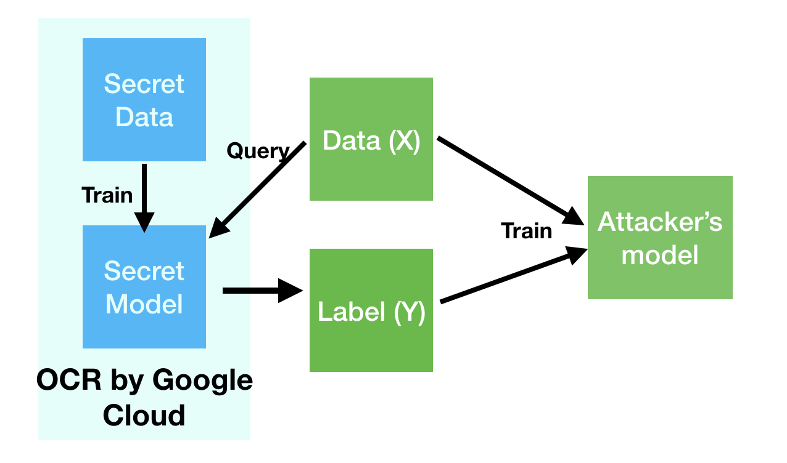
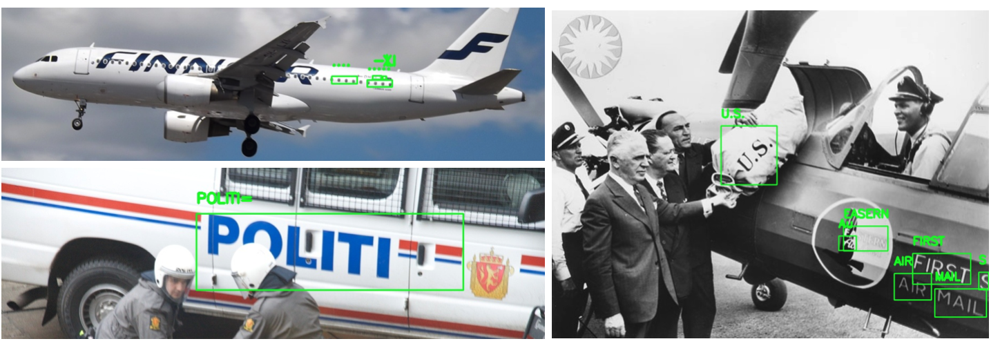
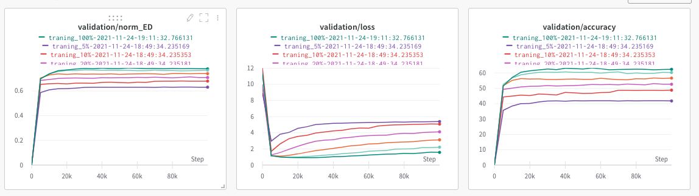
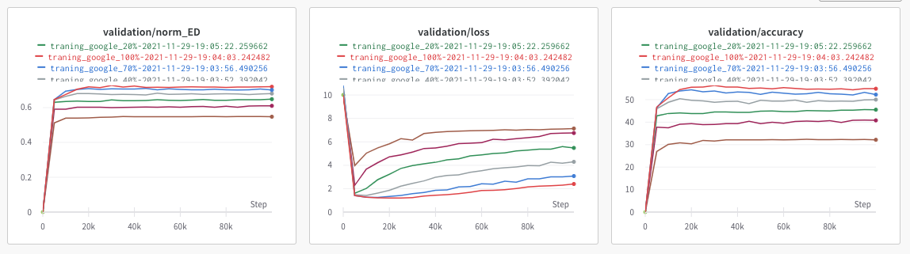

# CS 6431 Final Project (Evaluating the Risk of Efficient Model Extraction Attack to Steal the Knowledge from Public OCR APIs)




# Data
Data processing and annotation scripts are located under `/data/script`. We are undecided whther we will release our Google OCR annotation due to the ethical concerns and potential the term of use violation.
```
cd /data
mkdir TextOCR
mkdir TextOCR/basic
cd TextOCR/basic
wget https://dl.fbaipublicfiles.com/textvqa/data/textocr/TextOCR_0.1_train.json
wget https://dl.fbaipublicfiles.com/textvqa/images/train_val_images.zip
unzip https://dl.fbaipublicfiles.com/textvqa/images/train_val_images.zip
```
## Examples of Google OCR Annotations


# Models
Please follow the astep below to clone the model repo. We will release our modification patches once we resolve the conflicts.
```
mkdir models
cd models
git clone https://github.com/clovaai/deep-text-recognition-benchmark.git
```
## Visualization of Validation Curves Enabled by https://wandb.ai
### Trained on Human Annotations

### Trained on Google OCR Annotations



